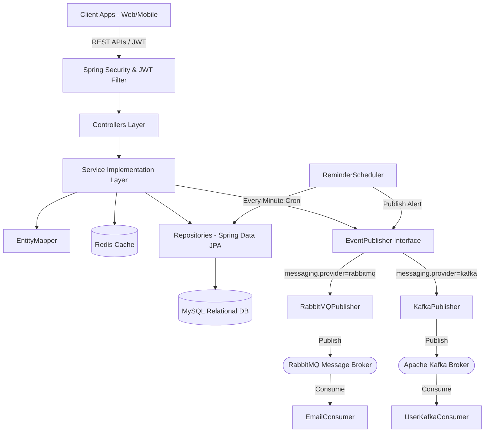
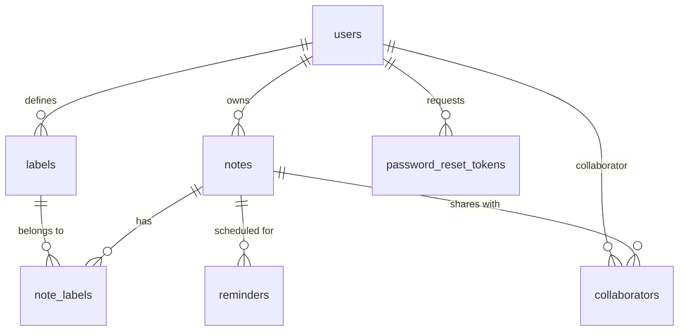
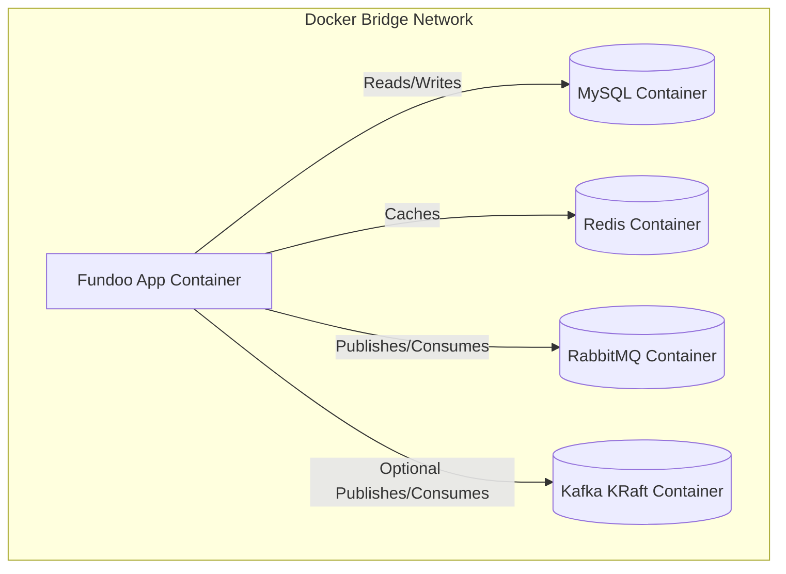

# Fundoo Notes Backend - Onboarding & Architecture Guide

Welcome to the **Fundoo Notes Backend** development team! This onboarding guide is designed to help new backend developers understand the application architecture, system design, data schemas, messaging infrastructure, caching strategies, setup instructions, and deployment pipelines.

---

## 1. System Architecture Overview

The backend is built as a cloud-ready, enterprise-grade Spring Boot micro-service using standard layered/MVC architecture pattern with cross-cutting components:



### Key Architectural Layers
1. **Controller Layer:** Exposes endpoints defined in [ApiConstants](file:///d:/BridgeLabz/MagicSoftware/fundoo/src/main/java/com/bridgelabz/fundoo/constant/ApiConstants.java). Standardizes return types using `ResponseEntity<APIResponse<T>>`. Fixes are applied to support paginated resources.
2. **Service Layer:** Houses core business logic, handles transactions, caches heavy read queries via Redis annotations, and fires generic domain events.
3. **Repository Layer:** Database abstraction interface using Spring Data JPA. Focuses on preventing N+1 queries using optimized `JOIN FETCH` statements and supports paginated listings.
4. **Loosely-Coupled Messaging:** Abstracts message broker communications using an `EventPublisher` interface. The system dynamically targets **RabbitMQ** or **Apache Kafka** based on `messaging.provider` properties.

---

## 2. Database Schema Design (MySQL)

We utilize Hibernate's automatic schema update (`ddl-auto=update`) in development. The tables are configured with specific indexes, unique keys, and optimistic locking to ensure high-performance concurrent database transactions.



### Table Specifications

#### A. `users` Table
* **Unique Constraints:** `uk_users_email` (unique index on `email`)
* **Indexes:** `idx_users_email` on column `email`
* **Optimistic Locking:** Inherits `version` from `BaseEntity`
* **Columns:**
  - `id` (BIGINT, Primary Key, Auto-increment)
  - `first_name` (VARCHAR(100), NOT NULL)
  - `last_name` (VARCHAR(100))
  - `email` (VARCHAR(255), NOT NULL, UNIQUE)
  - `phone_number` (VARCHAR(20))
  - `password` (VARCHAR(255), NOT NULL) - Bcrypt encoded
  - `role` (VARCHAR(20), NOT NULL) - values: `ROLE_USER`, `ROLE_ADMIN`
  - `active` (BOOLEAN, default true)
  - `verified` (BOOLEAN, default false)
  - `deleted` (BOOLEAN, default false)
  - `last_login_at` (DATETIME)
  - `deleted_at` (DATETIME)
  - `created_at`, `updated_at`, `version`

#### B. `notes` Table
* **Foreign Keys:** `owner_id` references `users(id)`
* **Indexes:** 
  - `idx_note_user` on `owner_id` (accelerates user dashboard queries)
  - `idx_note_title` on `title` (accelerates query search operations)
* **Columns:**
  - `id` (BIGINT, Primary Key, Auto-increment)
  - `title` (VARCHAR(500), NOT NULL)
  - `description` (VARCHAR(5000))
  - `color` (VARCHAR(30), default `#ffffff`)
  - `pinned` (BOOLEAN, default false)
  - `archived` (BOOLEAN, default false)
  - `trashed` (BOOLEAN, default false)
  - `deleted` (BOOLEAN, default false)
  - `deleted_at` (DATETIME)
  - `owner_id` (BIGINT, NOT NULL)

#### C. `labels` Table
* **Foreign Keys:** `user_id` references `users(id)`
* **Indexes:** `idx_label_user` on `user_id`
* **Columns:**
  - `id` (BIGINT, Primary Key, Auto-increment)
  - `name` (VARCHAR(100), NOT NULL)
  - `user_id` (BIGINT, NOT NULL)

---

## 3. Caching Architecture (Redis)

To maximize throughput and limit heavy MySQL read operations, Redis is integrated at the service layer level.

* **Cache TTL:** 1 Hour (Default)
* **Serialization Policy:** Keys are serialized as `StringRedisSerializer`, Values are serialized as `GenericJackson2JsonRedisSerializer` (JSON format).

### Cache Integration Strategy
1. **User Cache (`"users"`)**:
   - Cache key format: `users::<userId>`
   - Evicted or updated on user updates (`@CacheEvict` or `@CachePut`).
2. **Notes Cache (`"notes"`)**:
   - Cache key format: `notes::<noteId>`
   - Cache write: Triggered on fetching a note by ID.
   - Cache eviction: Automatically invalidated whenever a note is modified, deleted, color is patched, or label link status changes.

---

## 4. Message Broker Architecture (Loosely Coupled)

The backend provides pluggable messaging support via `EventPublisher`. The active publisher is determined dynamically at startup:

### A. RabbitMQ Topology (Default Mode)
- **Exchange:** `fundoo.exchange` (Topic Exchange)
- **Queues & Routing Keys:**
  1. `fundoo.user.queue` (bound via `user.register` routing key)
  2. `fundoo.password.queue` (bound via `password.reset` routing key)
  3. `fundoo.reminder.queue` (bound via `reminder.alert` routing key)
- **Consumer:** [EmailConsumer](file:///d:/BridgeLabz/MagicSoftware/fundoo/src/main/java/com/bridgelabz/fundoo/messaging/consumer/EmailConsumer.java) handles RabbitMQ listeners.

### B. Apache Kafka Topology (Standby/Alternative Mode)
- **Topics:**
  1. `user-events` (partitions=3, replicas=1)
  2. `reminder-alerts` (partitions=3, replicas=1)
  3. `audit-logs` (partitions=3, replicas=1)
- **Consumer:** [UserKafkaConsumer](file:///d:/BridgeLabz/MagicSoftware/fundoo/src/main/java/com/bridgelabz/fundoo/listener/UserKafkaConsumer.java) handles Kafka listeners.

---

## 5. Local Development Onboarding Setup

### Prerequisites
* **JDK:** Version 21
* **Build System:** Apache Maven 3.x
* **Databases/Brokers:** MySQL Server, Redis Server, RabbitMQ (or Apache Kafka)

### Setup Steps

#### Step 1: Create Database
Connect to your local MySQL instance and run:
```sql
CREATE DATABASE fundoo_db;
```

#### Step 2: Configure Environment Properties
Create or edit `src/main/resources/application-dev.properties` to match your local services (or override via environment variables):
```properties
# Database connection settings
spring.datasource.url=jdbc:mysql://localhost:3306/fundoo_db?allowPublicKeyRetrieval=true&useSSL=false
spring.datasource.username=root
spring.datasource.password=Passwd@123

# Messaging Broker Configuration (rabbitmq or kafka)
messaging.provider=rabbitmq

# RabbitMQ Settings
spring.rabbitmq.host=localhost
spring.rabbitmq.port=5672

# Redis connection
spring.data.redis.host=localhost
spring.data.redis.port=6379
```

#### Step 3: Run Build & Boot
```powershell
# Clean build and compile
mvn clean compile

# Boot the backend application
mvn spring-boot:run
```

Once booted, the server starts on port `8080`.
* **Swagger Documentation URL:** `http://localhost:8080/swagger-ui/index.html`

---

## 6. Docker Containerization & Orchestration

The application is containerized using a multi-stage Docker build separating compilation from runtime.

### Docker Compose Stack Topology
We configure and run our application stack (application, database, cache, and messaging) using [docker-compose.yml](file:///d:/BridgeLabz/MagicSoftware/fundoo/docker-compose.yml):



---

## 7. CI/CD Pipelines

### 1. GitHub Actions Workflow
Defined in [.github/workflows/docker-publish.yml](file:///d:/BridgeLabz/MagicSoftware/fundoo/.github/workflows/docker-publish.yml).
It triggers on pushes and pull requests to `dev` and `main` branches. It validates the build by running JUnit tests, compiles the Docker image, and automatically pushes the image tags (`latest`, and Git SHA commit tags) to Docker Hub under the `mugilanjagadeesan/fundoo-app` repository.

### 2. Jenkins declarative pipeline
Defined in the [Jenkinsfile](file:///d:/BridgeLabz/MagicSoftware/fundoo/Jenkinsfile).
It automates checking out code, running Maven test goals, executing local Docker builds, logging into Docker Hub securely using Credentials Binding, and pushing the tagged images.
